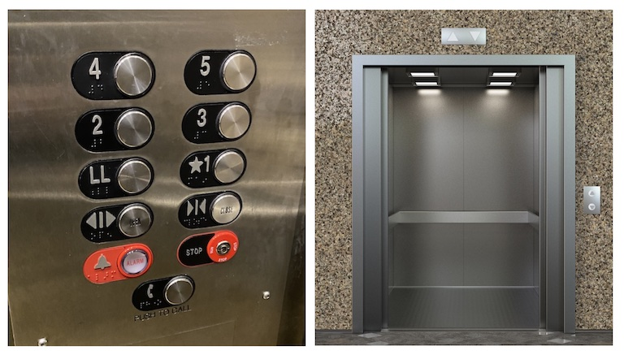

# rusty_elevator

A broken elevator may have inspired the creation of Rust, but could you actually code an elevator in
it? https://dabeaz.com/rusty_elevator.html

Rusty Elevator, June 28-29, 2025
================================

Copyright (C) 2025  
David Beazley (http://www.dabeaz.com)

Welcome
-------

Welcome to Rusty Elevator. This is a two-day coding challenge focused on
problem solving, design, and testing in Rust.

A little known fact about Rust is that an elevator figures prominently
into its origin story. This
[article](https://www.technologyreview.com/2023/02/14/1067869/rust-worlds-fastest-growing-programming-language/)
has more detail, but I'm struck by the following quote from Graydon Hoare:

> It’s ridiculous, that we computer people couldn’t even make an
> elevator that works without crashing!

To me, that sounds like a challenge!   How hard could it possibly be to code
an elevator?!? What does that even mean? In this project, we'll attempt to find out.

Problem Overview
----------------

The goal of this project is straightforward---could I, a computer
person, actually write code that I think could be safely used to control
an actual elevator? If so, what qualities would that software have?
This is certainly an incomplete list, but here are some things
that come to mind:

* I've used an elevator. The code should make an elevator work in
  exactly the same way that I've observed elevators to work from first-hand
  observation. There is even an [elevator algorithm](https://en.wikipedia.org/wiki/Elevator_algorithm).

* It should be possible to specify expected elevator behavior in some
  kind of formal way that allows for program verification (i.e.,
  how are you going to prove that your code works the same way that
  an elevator actually works?).

* The code should make proper use of abstraction layers to isolate
  high-level elevator algorithm logic from low-level system implementation
  details related to elevator hardware.

* The code should be testable and debuggable.

* The code should be written in a well-organized way that can be
  read and understood by others (i.e., pass a code review).

* The code should be written in way to be extensible should
  new requirements arise.

* The code should have a well-defined interface that could
  potentially allow it to be used with an actual elevator
  (if incorporated as a programming library into a larger system
  for instance).

All of these are admirable software engineering goals. Basically,
what I'm proposing is to write something that's not hacky and for
which I'm reasonably confident that it works without crashing.

The Elevator
------------
Elevator systems a are potentially a very complicated thing (think
of the setup in a high-rise building). I'm not proposing that.
Instead, we're going to work with a very basic setup. Imagine a
single elevator car in a 5 floor building. A button-panel
inside the car is used to select destination floors. Up and down buttons
in the building are used to request the elevator. Up and down
indicator lights show the elevator direct when it arrives at a floor.
That's it!   The following picture gives a visual overview:

A simulator for this elevator system can be found in the `lifty/`
directory. The simulator mimics the elevator hardware, but it does
not have any algorithmic logic at all--providing the algorithm is the
whole point of this project!  Note: the simulator is only one instance
of elevator hardware. Your solution shouldn't be dependent on the
low-level details of the simulator (for instance, if someone wanted
to use your code to drive an actual elevator in the real world).

