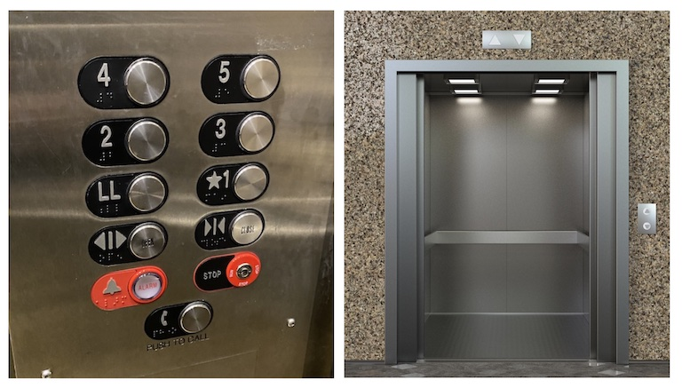

# Lifty - The Elevator

Author: David Beazley (https://www.dabeaz.com)  
Source: https://github.com/dabeaz/lifty  

Copyright (C) 2025

Graydon decides that he's going to go visit his friend Fletcher. He
arrives at his apartment building and gets in the elevator.  However,
instead of a typical building directory, the following puzzler is
posted:

>    Baker, Cooper, Fletcher, Miller, and Smith live here.  They each
>    live on a different floor. Baker does not live on the top
>    floor. Cooper does not live on the bottom floor. Fletcher does not
>    live on either the top or the bottom floor. Miller lives on a higher
>    floor than does Cooper. Smith does not live on a floor adjacent to
>    Fletcher. Fletcher does not live on a floor adjacent to Cooper.

"Ah, hell, what kind of
[madness](https://sarabander.github.io/sicp/html/4_002e3.xhtml#g_t4_002e3_002e2)
is this?" he mumbles.  After turning over all of the solutions in his
mind before arriving at the correct floor, he pushes the elevator
button only to find that the elevator software has crashed.

"It's [ridiculous](https://www.technologyreview.com/2023/02/14/1067869/rust-worlds-fastest-growing-programming-language/)," he thought, "that we computer people can't even
make an *elevator* that works without crashing!"  Indeed.  How hard
could it be?  An elevator goes up and down. Doors open and close.
Maybe it's kind of like a glorified toaster. 

## Overview

An elevator is an object from everyday experience that most people
would claim to understand.  However, elevators are surprisingly
devious.  Thus, an elevator makes a great problem domain for all sorts
of computer science problems involving algorithms, design, testing,
systems, formal verification, software engineering, and more.  

What you'll find here is a simulator of elevator hardware with none of
the brains of elevator control. It's intended use is as an
educational tool.  Thus, think of it as an empty canvas for exploring
various kinds of programming projects involving elevators (see the
"Ideas" section at the end for possible projects).

The simulator models an elevator system consisting of a single car in
a five-floor building.  It's nothing fancy--the image below gives you
a visual reference for the setup.



The hardware has the following features:

* A single elevator car.
* A motor that makes the car go up and down.
* A door that can open and close.
* A button panel inside the car.
* Up buttons on floors 1-4.
* Down buttons on floors 2-5.
* Indicator lights on each floor that can show a direction.

Certain elevator features such door open/close buttons, an emergency key, 
and other things are ommitted in the interest of simplicity.

You can control the elevator by typing commands in the terminal or by
sending network messages.  The simulator can also report real-time
events to a separate control program via the network.

## The Simulator 

The simulator is implemented in a file `lifty.rs`.  This is a
single-file Rust project with no dependencies.  Compile it to create
the `lifty` program:

```
bash % rustc lifty.rs
```

If you run it, you'll get output like this:

```
bash % ./lifty
Welcome!  I'm Lifty--a simulated elevator in a 5-floor building.

I'm just hardware, but you can press my buttons
(type below and hit return):

    Pn  - Floor n button on panel inside car
    Un  - Up button on floor n
    Dn  - Down button on floor n

If something goes wrong, I'll crash and you'll have to call
maintenance to restart the elevator control program.

[ FLOOR 1 | CLOSED     -- | P:----- | U:----- | D:----- ] :
```

The elevator is stopped on the first floor with the door closed.
You can type commands after the `:`.  Try pressing a few buttons by
typing "P2", "U3", and "D5" separately.  The output should change to
the following:

```
[ FLOOR 1 | CLOSED   -- | P:----- | U:----- | D:----- ] : P2
[ FLOOR 1 | CLOSED   -- | P:-2--- | U:----- | D:----- ] : U3
[ FLOOR 1 | CLOSED   -- | P:-2--- | U:--3-- | D:----- ] : D5
[ FLOOR 1 | CLOSED   -- | P:-2--- | U:--3-- | D:----5 ] :
```

Here, the hardware has recorded some button presses (imagine that the
buttons are now illuminated as in an actual elevator).  However, there
are no brains built into the simulator.  Literally nothing
happens. You can instruct the hardware to do things though. Try
opening the door by typing "DO".  You'll see the elevator status show
"OPENING" for a few seconds before changing to "OPEN".  The output
will look like this:

```
[ FLOOR 1 | CLOSED   -- | P:-2--- | U:--3-- | D:----5 ] : DO
[ FLOOR 1 | OPENING  -- | P:-2--- | U:--3-- | D:----5 ] : 
[ FLOOR 1 | OPEN     -- | P:-2--- | U:--3-- | D:----5 ] :
```

Try closing the door by typing "DC".  You should see the elevator
status show "CLOSING" for a few seconds before finally changing to
"CLOSED".   Although the output is basic, the elevator is dynamic,
has internal timing, and will change its state automatically (updating
the output as needed).  It might look weird to see all of
the state changes printed in order, but you'll appreciate this
feature when it comes to explaining what's happening or for
debugging.

Try typing "MU" to have the elevator start moving up.  You
should see the floor slowly increment about every 3-4 seconds. 
Eventually the elevator will crash with a message like this:

```
[ FLOOR 1 | CLOSED   -- | P:-2--- | U:--3-- | D:----5 ] : MU
[ FLOOR 1 | UP       -- | P:-2--- | U:--3-- | D:----5 ] :
[ FLOOR 2 | UP       -- | P:-2--- | U:--3-- | D:----5 ] :
[ FLOOR 3 | UP       -- | P:-2--- | U:--3-- | D:----5 ] :
[ FLOOR 4 | UP       -- | P:-2--- | U:--3-- | D:----5 ] :
[ FLOOR 5 | UP       -- | P:-2--- | U:--3-- | D:----5 ] :
CRASH! : Hit the roof!
[ FLOOR 5 | CRASH    -- | P:-2--- | U:--3-- | D:----5 ] :
```

Again, the hardware is dumb.  The elevator did not stop at any floor
and just slammed into the top of the building.  Once crashed, the
elevator stays crashed and won't respond to any future commands until
you issue a reset (R).

Giving the elevator bad combinations of commands will also cause it
to crash.   For example, telling it to open the doors and then move.

```
[ FLOOR 5 | CRASH    -- | P:-2--- | U:--3-- | D:----5 ] : R
[ FLOOR 1 | CLOSED   -- | P:----- | U:----- | D:----- ] : DO
[ FLOOR 1 | OPENING  -- | P:----- | U:----- | D:----- ] : 
[ FLOOR 1 | OPEN     -- | P:----- | U:----- | D:----- ] : MU

CRASH! : motor command received while doors open
[ FLOOR 1 | CRASH    -- | P:----- | U:----- | D:----- ] :
```

The simulator is pretty sensitive to timing related issues
and various modal errors.  For example, if you tried to
open the doors twice:

```
[ FLOOR 5 | CRASH    -- | P:-2--- | U:--3-- | D:----5 ] : R
[ FLOOR 1 | CLOSED   -- | P:----- | U:----- | D:----- ] : DO
[ FLOOR 1 | OPENING  -- | P:----- | U:----- | D:----- ] : 
[ FLOOR 1 | OPEN     -- | P:----- | U:----- | D:----- ] : DO

CRASH! : door already open
[ FLOOR 1 | CRASH    -- | P:----- | U:----- | D:----- ] : 
```

## Remote Access

Although the above example involved typing commands at the terminal,
the simulator can also receive commands over the network using a UDP
socket.  Start the `lifty` program in a separate terminal window.
Now, go to a different terminal and start Python (which provides a
good environment for interactive experimentation).  Try the following
example:

```python
>>> from socket import *
>>> sock = socket(AF_INET, SOCK_DGRAM)
>>> sock.bind(('localhost', 11000))
>>> sock.sendto(b'R', ('localhost', 10000))
1
>>> sock.sendto(b'DO', ('localhost', 10000))
2
>>>
```

The Lifty program should be showing an elevator with the door open like
this:

```
[ FLOOR 1 | CRASH    -- | P:----- | U:----- | D:----- ] : recv: R
[ FLOOR 1 | CLOSED   -- | P:----- | U:----- | D:----- ] : recv: DO
[ FLOOR 1 | OPENING  -- | P:----- | U:----- | D:----- ] :
[ FLOOR 1 | OPEN     -- | P:----- | U:----- | D:----- ] :
```

Any command that can be typed at the prompt can also be sent to Lifty
via a socket.  All commands received in this way will be printed, but
prefaced by a "recv:" to indicate that they were received over the
network.

## Events

Lifty also generates certain events that get sent to a control program.
In the same Python example above, type the following to receive an
event:

```python
>>> sock.recvfrom(100)
(b'O1', ('127.0.0.1', 50903))
>>> 
```

You'll immediately see an "O1" event. This is something the simulator
sent when the doors finished opening.   Now, type this in Python:

```python
>>> sock.recvfrom(100)
... blocked (waiting)
```

Python will be blocked waiting for a message. Go the Lifty prompt and type "DC" 
to close the doors. Lifty will briefly display "CLOSING" before shifting to "CLOSED"
like this:

```
[ FLOOR 1 | OPEN     -- | P:----- | U:----- | D:----- ] : DC
[ FLOOR 1 | CLOSING  -- | P:----- | U:----- | D:----- ] :
[ FLOOR 1 | CLOSED   -- | P:----- | U:----- | D:----- ] :
```

The Python program should have now returned with a message like this:

```python
>>> sock.recvfrom(100)
(b'C1', ('127.0.0.1', 50903))
>>>
```

The "C1" event means that the doors just closed on floor 1.  Put the
Python program into a loop like this:

```python
>>> while True:
...     print(sock.recvfrom(100))
...
```

Now, type "MU" into the Lifty program to turn the motor on.  You should
see the following appear in the Python terminal before the elevator
crashes into the roof:

```python
>>> while True:
...     print(sock.recvfrom(100))
...
(b'A2', ('127.0.0.1', 50903))
(b'A3', ('127.0.0.1', 50903))
(b'A4', ('127.0.0.1', 50903))
(b'A5', ('127.0.0.1', 50903))
```

These are events indicating that the elevator is approaching a new
floor.   Again, the elevator is pretty dumb.  It will keep moving
unless you tell it to stop.   Here's a modified Python example
that illustrates stopping on the 4th floor:

```python
>>> while True:
...     msg, _ = sock.recvfrom(100)
...     if msg == b'A4':
...         sock.sendto(b'S', ('localhost', 10000))
...         break
...
```

With that running, go to the Lifty window and type "R" followed by "MU".  You 
should see the elevator slowly start moving up and stopping as soon as it
reaches the 4th floor.  The final state will look like this:

```
[ FLOOR 5 | CRASH    -- | P:----- | U:----- | D:----- ] : R
[ FLOOR 1 | CLOSED   -- | P:----- | U:----- | D:----- ] : MU
[ FLOOR 1 | UP       -- | P:----- | U:----- | D:----- ] : 
[ FLOOR 2 | UP       -- | P:----- | U:----- | D:----- ] : 
[ FLOOR 3 | UP       -- | P:----- | U:----- | D:----- ] : recv: S
[ FLOOR 3 | STOPPING -- | P:----- | U:----- | D:----- ] : 
[ FLOOR 4 | CLOSED   -- | P:----- | U:----- | D:----- ] :
```

The "STOPPING" state means the elevator has been instructed to stop
at the next floor and is in the process of doing so. 
The "CLOSED" state indicates that the elevator has fully stopped.
If you want it to open the doors, a "DO" command
must be sent.  You can do that from Python if you want:

```python
>>> sock.sendto(b'DO', ('localhost', 10000))
2
>>>
```

This is the basic idea of Lifty.  It's the simulated hardware of an
elevator, but none of the brains of an elevator.  It will try to
show you everything that is happening though.

## Commands

Here is a complete list of commands that Lifty understands.  These
may be typed at the prompt or sent to Lifty via a socket.

```
Pn  - Press panel button n
Un  - Press up button on floor n
Dn  - Press down button on floor n
MU  - Start moving up
MD  - Start moving down
S   - Stop moving (will generate Sn event when stopped)
DO  - Open door (will generate On event when done)
DC  - Close the door (will generate Cn event when done)
CPn - Clear panel button n
CUn - Clear up button n
CDn - Clear down button n
IUn - Set indicator light on floor n to "up"
IDn - Set indicator light on floor n to "down"
CIn - Clear the indicator light on floor n
R   - Reset
```

I'd encourage you to play around with the hardware by typing various commands
at the Lifty prompt.  You should see the elevator respond in various ways.
You'll probably make it crash quite a bit too--remember to type "R" to
reset it after this happens.

## Events

Lifty generates the following events that are sent via a UDP socket to
a separate control program assumed to be listening on port 11000.

```
Pn - Panel button for floor n was pressed
Un - Up button on floor n was pressed
Dn - Down button floor n was pressed
An - Approaching floor n (in motion)
Sn - Stopped at floor n (safe to open doors)
Cn - Door closed on floor n (now safe to move)
On - Door opened on floor n (door fully open)
```

If there is a control program running, it would make decisions about what
to do next based on these events. Emphasis: The simulator itself has
no smarts built into it other than some basic defense to avoid cutting
passengers in half.

## Small Details

Elevators in the real world do a lot of things with illuminated
buttons and lights.  The simulator mimics this behavior but requires
explicit control.  For example, if a button gets pressed, it will
light up and stay lit up until it is explicitly cleared by a command.
Try this:

```
[ FLOOR 1 | CLOSED   -- | P:----- | U:----- | D:----- ] : P3
[ FLOOR 1 | CLOSED   -- | P:--3-- | U:----- | D:----- ] : CP3
[ FLOOR 1 | CLOSED   -- | P:----- | U:----- | D:----- ] :
```

The "P3" presses a button on the panel.  The "CP3" command clears
the associated light.  It is assumed that "CP3" would be sent by
whatever control software is running.  For example, when an elevator
stops on floor 3, the control software would clear the button light.
Again, lights are never cleared on their own by the simulator.

Direction indicator lights are a helpful user interface for riders
that is easy to overlook.  Close your eyes and visualize your use of
an elevator.  Yes, when the elevator arrives at your floor, there is
usually some kind of light that displays the direction of travel where
the elevator is going next.  The simulator has this, but it must be
explicitly controlled.  Here is an example of setting a direction
indicator light. The "IU1" command illuminates the "Up" arrow on floor
1 (shown by "^^").  The "CI1" command turns the indicator light off.

```
[ FLOOR 1 | CLOSED   -- | P:----- | U:----- | D:----- ] : IU1
[ FLOOR 1 | CLOSED   ^^ | P:----- | U:----- | D:----- ] : CI1
[ FLOOR 1 | CLOSED   -- | P:----- | U:----- | D:----- ] : 
```

Indicator lights are finicky. Only one such light can be illuminated
at a time in the entire building and not all floors have the same
lights.  For example, if you try to turn on the "Down" arrow on floor
1, you'll crash the simulator:

```
[ FLOOR 1 | CLOSED   -- | P:----- | U:----- | D:----- ] : ID1

CRASH! : No down indicator light on bottom floor
[ FLOOR 1 | CRASH    -- | P:----- | U:----- | D:----- ] :
```

Buttons and direction indicator lights don't have any impact on the
operation of the simulator other than generating an event when 
a button gets pressed.  For example, the elevator is *NOT* going to
stop just because a button is illuminated---remember that the
simulator is dumb.

If you're giving some kind of class project, buttons and lights can be
a great source of pedantic point deductions.  "Why did I get a B?"
"Because you didn't turn off the up button light upon car arrival."
"I hate you."  You get the idea.

## Project Ideas

Now that you've seen the simulator, what might you do with it? Here are some 
possible ideas:

### Projects Involving the Use of the Simulator

* **An evil coding project involving elevators.**  If an elevator isn't
  so hard to code, then do it!  Moreover, prove to everyone else that
  a) your code corresponds to how an elevator actually works in
  reality and b) your code will never crash the elevator, deadlock, or
  exhibit other strange behavior.  This is a project that I give in
  some of my courses such as [Advanced Programming with
  Python](https://dabeaz.com/advprog.html) or [Rusty
  Elevator](https://dabeaz.com/rusty_elevator.html).  It's fun.

* **An evil vibe coding project.**  "Here's some hardware for an 
  elevator--go write the software for controlling it."  No further guidance
  of any kind is given.  Now sit back with a wry smile
  as you watch the resulting process of self-discovery unfold. 

* **An evil job interview question.** Kind of like the vibe coding idea, but
  only give applicants an hour to work on it to see how 10x they are.
  Make sure you record the camera so you can see all of the sweating.

* **An evil object-oriented design project.** Apply various OO design
  principles to the problem of controlling an elevator.  Is this an
  opportunity to practice dependency injection?  Or apply the state
  machine pattern?  Or to accidentally unleash a zombie hoard by
  mispronouncing one of the words while uttering
  "model-view-control?" Yeah, maybe.
  
* **An evil formal modeling project.** Use the features of the simulator
  as the basis for formally specifying an elevator control algorithm 
  using a tool like TLA+.  Once you've convinced yourself that the
  algorithm is correct, code it in your favorite language and watch
  the elevator work on the first try.  If not, you get an F.
  
* **An evil human factors project.** Do elevators in the real world
  actually work like the classic elevator algorithm might suggest?  Go 
  study an actual elevator and carefully observe its behavior.  You
  might be surprised at what you find out.  Note: this can be a
  surprising rich area of class discussion if you go there. Computers
  are usually predictable. Humans? Not so much.
  
* **An evil elevator demonstration tool.**  Maybe you're trying to
  explain some kind of puzzler problem involving elevators.  Your joke
  involving a reference to the ending of the Blues Brothers fell flat,
  so you've decided that a live demo would be better. Fire up Lifty
  and say "now visualize yourself riding this elevator in the Building
  of the Imagination--as perfectly embodied by this text-only program
  running in the terminal."
  
  
### Projects Involving the Simulator Program Itself

* **Adaptation into adjacent evil.**  Could you modify this code into
  something like a simulation of a hard drive?  Yeah, maybe.  That
  seems like a good way to make students of an operating systems
  course cry.  John Azariah, clearly an evil person himself, has
  suggested to me that an elevator might not be too unlike a Turing
  machine.
  
* **An evil code porting project.**  The simulator is written in Rust. 
  Give students a project to simply port it to C++ or Python.  Emphasis
  on the word "simply."

* **An evil refactoring project.** Refactor the simulator so that it
  corresponds to an eight car elevator system in a 20 story building.
  "Claude? Claude?! Is this mic on?"
  
* **An evil Rust refactoring project.**  Refactor the simulator
  so that's based on a different Rust programming approach such as
  asynchronous I/O.

* **An evil code review project.** Carefully review the code in
  the simulator and think of ways that it be improved and/or 
  simplified without giving up any functionality. Can I think of
  some possible improvements? Yes, I can. But, can you?

* **An evil physics project.** Imagine an elevator in a 100 story
  building where the elevator now accelerates up to about 30mph. Is
  it going to stop instantly when you press a button?  No, it's not.
  There are going to be forces.  And those forces say that you 
  should probably model the elevator hoist using a differential 
  equation instead of a simple "Up", "Down", "Off" modal selection.

* **A probably not-so-evil example of event-driven Rust programming.**
  I wouldn't claim to be any kind of Rust expert, but the simulator
  involves a variety of Rust programming features including structs,
  enums, `Option<>`, `Result<>`, I/O, channels, threads, sockets, and
  timers.  That's probably at least two or three Stack Overflow
  questions answered all in one place.

## Feedback

This software is provided "as is."  However, if you've found a bug or
have ideas for improvement, feel free to submit a bug report or PR.
Be advised that I do *NOT* intend to make this an official open source
package or something that could be installed via a package manager. 
It's purely for education purposes and my own amusement.

P.S. If you like stuff like this, come take a [course](https://dabeaz.com/courses.html).
  

  


